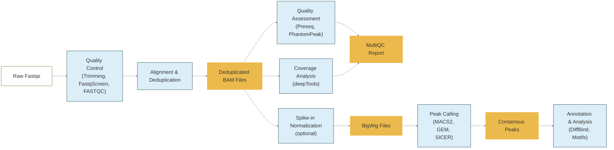

# CHAMPAGNE 🍾

**CH**rom**A**tin i**M**muno **P**recipit**A**tion sequencin**G** a**N**alysis pip**E**line

[](https://github.com/CCBR/CHAMPAGNE/actions/workflows/build.yml)
[](https://ccbr.github.io/CHAMPAGNE)
[](https://doi.org/10.5281/zenodo.10516078)
[](https://github.com/CCBR/CHAMPAGNE/releases/latest)

View the full documentation website: <https://ccbr.github.io/CHAMPAGNE>



View a detailed version of the workflow diagram on the documentation website:
<https://ccbr.github.io/CHAMPAGNE/latest/diagram/workflow>

## Set up

Champagne is installed on the [Biowulf HPC](#biowulf).
For installation in other execution environments,
refer to the [docs](https://ccbr.github.io/CHAMPAGNE/).

### Biowulf

Champagne is available on [Biowulf](https://hpc.nih.gov/) in the `ccbrpipeliner` module.
You'll first need to start an interactive session, then load the module:

```sh
# start an interactive node
sinteractive --mem=2g --cpus-per-task=2 --gres=lscratch:200

# load the ccbrpipeliner module
module load ccbrpipeliner
```

## Quickstart

Initialize and run champagne with test data:

```sh
# copy the champagne config files to your project directory.
# --output is optional and defaults to your current working directory.
champagne init --output /data/$USER/champagne_project

# preview the champagne jobs that will run with the test dataset
champagne run --output /data/$USER/champagne_project \
  --mode local -profile test -preview

# launch a champagne run on slurm with the test dataset
champagne run --output /data/$USER/champagne_project \
  --mode slurm -profile test
```

To run champagne on your own data, you'll need to create a sample sheet.
Take a look at these examples:

- [assets/samplesheet_test.csv](https://github.com/CCBR/CHAMPAGNE/blob/main/assets/samplesheet_test.csv) - mix of single and paired end reads downloaded from github.
- [assets/samplesheet_full_mm10.csv](https://github.com/CCBR/CHAMPAGNE/blob/main/assets/samplesheet_full_mm10.csv) - single end reads on biowulf.

Once you've created a samplesheet with paths to your fastq files,
run champagne with the `--input` option to specify the path to your sample sheet:

```sh
champagne run --output /data/$USER/champagne_project \
    --mode slurm \
    --input samplesheet.csv \
    --genome hg38
```

### Parameters

You can specify workflow parameters via the command line or in a YAML file.
Here's an example YAML file with some common parameters:

`assets/params.yml`

```YAML
input: './assets/samplesheet_full_mm10.csv'
contrasts: './assets/contrasts_full_mm10.csv'
genome: mm10
run_gem: false
run_chipseeker: false
run_qc: true
```

You can then use these parameters with the `-params-file` option:

```sh
champagne run --output /data/$USER/champagne_project \
    --mode slurm \
    -params-file assets/params.yml
```

View the [full list of parameters](https://ccbr.github.io/CHAMPAGNE/dev/guide/params)
in the documentation.

### Reference Genomes

View [the list of available reference genomes](https://ccbr.github.io/CHAMPAGNE/dev/guide/genomes)
to see which genomes are pre-configured for use with champagne on biowulf.
If you'd like to use a genome that's not already available, view the
[guide on preparing a custom reference genome](https://ccbr.github.io/CHAMPAGNE/dev/guide/genomes/#custom-reference-genome).

### Spike-in Control

If your experiment uses a spike-in control, you can specify the spike-in genome
with the `--spike_genome` parameter:

```sh
champagne run --output /data/$USER/champagne_project \
    --mode slurm \
    --input samplesheet.csv \
    --genome hg38 \
    --spike_genome dmelr6.32 \
    --deeptools_normalize_using None
```

View [the spike-in docs](https://ccbr.github.io/CHAMPAGNE/dev/guide/spike-in/)
for more information on how to use & customize spike-in controls.

## Help & Contributing

Come across a **bug**? Open an [issue](https://github.com/CCBR/CHAMPAGNE/issues)
and include a minimal reproducible example.

Have a **question**? Ask it in
[discussions](https://github.com/CCBR/CHAMPAGNE/discussions).

Want to **contribute** to this project? Check out the
[contributing guidelines](.github/CONTRIBUTING.md).

**General Inquiries and Collaboration:** Please contact the CCBR Pipeliner team
at [CCBR_Pipeliner@mail.nih.gov](mailto:CCBR_Pipeliner@mail.nih.gov).

## References

This repo was originally generated from the
[CCBR Nextflow Template](https://github.com/CCBR/CCBR_NextflowTemplate).
The template takes inspiration from nektool[^1] and the nf-core template.
If you plan to contribute your pipeline to nf-core, don't use this template --
instead follow nf-core's instructions[^2].

[^1]: nektool https://github.com/beardymcjohnface/nektool

[^2]: instructions for nf-core pipelines https://nf-co.re/docs/contributing/tutorials/creating_with_nf_core
