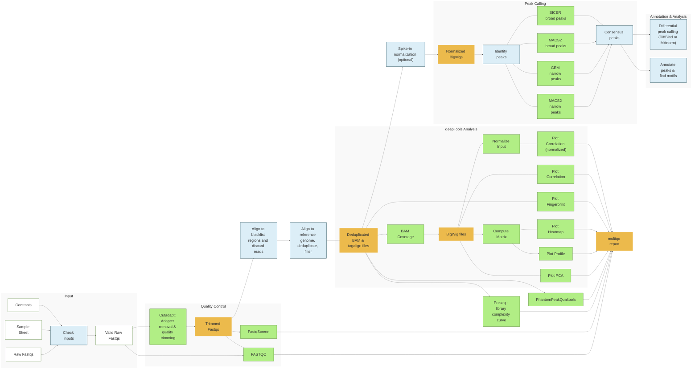

# CHAMPAGNE Workflow Diagram

```mermaid
flowchart LR

%%{init: {
  "themeVariables": {
     "background": "transparent",
     "fontSize": "35px" },
  "flowchart": {
    "nodeSpacing": 80,
    "rankSpacing": 80,
    "padding": 35,
    "htmlLabels": true
}}}%%

  %% Input
  subgraph INPUT["Input"]
    Raw["Raw Fastqs"]:::input
    Raw --> Check["Check inputs"]:::process
    Samplesheet["Sample Sheet"]:::input --> Check
    Contrasts:::input --> Check
    Check --> valid_raw["Valid Raw Fastqs"]:::input
  end


  %% Quality Control
  subgraph QC["Quality Control"]
    valid_raw --> Trimming["Cutadapt: Adapter removal & quality trimming"]:::tool
    Trimming --> Trimmed["Trimmed Fastqs"]:::output
    Trimmed --> fqscreen["FastqScreen"]:::tool
    valid_raw --> fqc["FASTQC"]:::tool
    Trimmed --> fqc
  end
  fqc --> MultiQC["multiqc report"]:::output
  fqscreen --> MultiQC

  %% Alignment
  Trimmed --> Blacklist["Align to blacklist regions and discard reads"]:::process
  Blacklist --> Align["Align to reference genome, deduplicate, filter"]:::process
  Align --> BAMs["Deduplicated BAM & tagalign files"]:::output

  %% Library & Complexity Assessment
  BAMs --> preseq["Preseq - library complexity curve"]:::tool
  BAMs --> ppqt["PhantomPeakQualtools"]:::tool
  preseq ---> MultiQC
  ppqt --> MultiQC

  %% Normalization
  BAMs --> Spike["Spike-in normalization (optional)"]:::process
  Spike --> NormBigwigs["Normalized Bigwigs"]:::output

  %% deepTools Analysis
  subgraph DEEPTOOLS["deepTools Analysis"]
    BAMs --> BAMcov["BAM Coverage"]:::tool
    BAMcov --> Bigwig["BigWig files"]:::output
    Bigwig --> Normalize["Normalize Input"]:::tool
    Bigwig --> Correlation["Plot Correlation"]:::tool
    Bigwig --> PCA["Plot PCA"]:::tool
    Normalize --> CorrelationNorm["Plot Correlation (normalized)"]:::tool
    Bigwig --> Matrix["Compute Matrix"]:::tool
    Matrix --> Profile["Plot Profile"]:::tool
    Matrix --> Heatmap["Plot Heatmap"]:::tool
    BAMs --> Fingerprint["Plot Fingerprint"]:::tool

  end

  PCA --> MultiQC
  Profile --> MultiQC
  Heatmap --> MultiQC
  Fingerprint --> MultiQC
  Correlation --> MultiQC
  CorrelationNorm --> MultiQC

  %% Peak Calling
  subgraph PEAK["Peak Calling"]
    NormBigwigs --> Peakcalling["Identify peaks"]:::process
    Peakcalling --> MACS2narrow["MACS2 narrow peaks"]:::tool
    Peakcalling --> GEM["GEM narrow peaks"]:::tool
    Peakcalling --> MACS2broad["MACS2 broad peaks"]:::tool
    Peakcalling --> SICER["SICER broad peaks"]:::tool
    MACS2narrow --> Consensus["Consensus peaks"]:::process
    GEM --> Consensus
    MACS2broad --> Consensus
    SICER --> Consensus
  end

  %% Downstream Analysis
  subgraph DOWNSTREAM["Annotation & Analysis"]
    Consensus --> Diffbind["Differential peak calling (DiffBind or MAnorm)"]:::process
    Consensus --> Annotate["Annotate peaks & find motifs"]:::process
  end

  %% Styles - FNL branding theme
  classDef input fill:#ffffff,stroke:#528230,stroke-width:2px;
  classDef process fill:#dceef7,stroke:#19424e,stroke-width:2px;
  classDef tool fill:#b1ee85,stroke:#528230,stroke-width:2px;
  classDef output fill:#ecba4c,stroke:none;

  %% Subgraph styling
  style INPUT fill:#f9f9f9,stroke:none;
  style QC fill:#f9f9f9,stroke:none;
  style DEEPTOOLS fill:#f9f9f9,stroke:none;
  style PEAK fill:#f9f9f9,stroke:none;
  style DOWNSTREAM fill:#f9f9f9,stroke:none;
```
